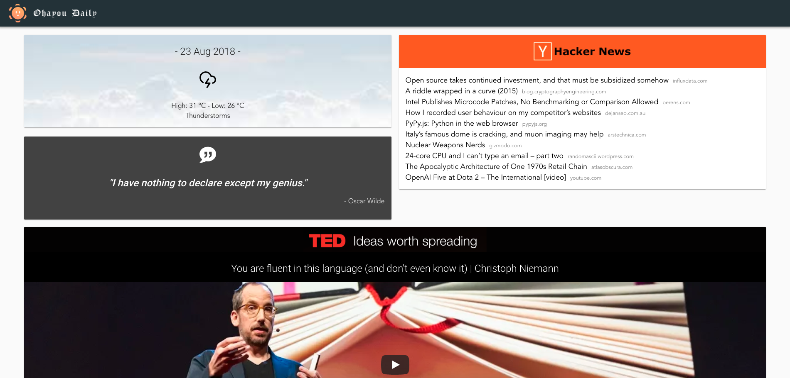

# Ohayou Dashboard

## A daily dashboard to start your day right!


## What's built in:
- Vuetiful frontend!
- Today's weather forecast in Tokyo, Japan
- Current top 10 HackerNews articles based on votes
- A famous quote to inspire you
- The latest TED Talk for some quick learning
- A daily word with its definition (from Urban Dictionary)
- A love compatibility tester, because why not?

## Future Goals:
- Insert your own city for weather forecasting
- Hearthstone random card information
- Cryptocurrency news and prices
- Daily Horoscope

## APIs
### Rakuten Rapid API:
- [Rakuten Rapid API Home](https://english.api.rakuten.net/)
- [YahooWeatherAPI](https://english.api.rakuten.net/dimashirokov/api/YahooWeatherAPI)
- [HackerNews API](https://english.api.rakuten.net/dimashirokov/api/HackerNews)
- [Random Famous Quotes](https://english.api.rakuten.net/andruxnet/api/Random%20Famous%20Quotes)
- [Urban Dictionary](https://api.rakuten.net/community/api/Urban%20Dictionary)
- [Love Compatibility](https://api.rakuten.net/ajith/api/Love%20Calculator)

### Others APIs:
- [Youtube Data API](https://developers.google.com/youtube/v3/)

## Project setup
```
yarn install
```

### Compiles and hot-reloads for development
```
yarn serve
```

### Compiles and minifies for production
```
yarn build
```

## Start local server
Starts a local server with the built files. Requires `yarn build` or `yarn heroku-postbuild` to be run for it to work.
```
yarn start
```

### Lints and fixes files
```
yarn lint
```